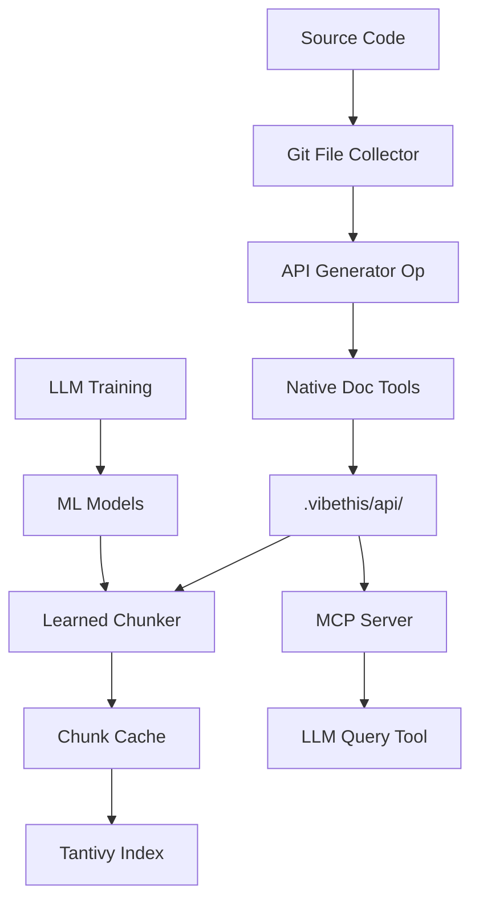

# Unified API Documentation System Specification

## Overview
A complete system for generating, indexing, and querying API documentation optimized for LLM consumption. Combines recipe-based generation with ML-powered chunking and efficient querying.

## System Components

### 1. Recipe Layer (Orchestration)
- **cell-documentation-generator-spec.md**: Main recipe for generating docs
- **api-generator-op-spec.md**: Go RegisterableActivity for API extraction
- **api-generator-framework-spec.md**: Language-specific script framework

### 2. Storage Layer
- **api-documentation-system-spec.md**: Directory structure and MCP server
- Location: `.vibethis/api/<language>/` for documentation files
- Cache: `~/.cache/vibethis/` for chunks and models

### 3. Intelligence Layer
- **learned-chunking-spec.md**: ML-based document chunking
- Self-training system using LLM annotations
- Per-language RandomForest classifiers

### 4. Query Layer
- MCP server for LLM tool integration
- Tantivy-based full-text search
- Smart chunking with caching

## Data Flow



## Integration Architecture

### Phase 1: Document Generation (Build Time)

```yaml
# Recipe execution
name: generate_cell_docs
sequence:
  - id: collect_files
    op: git_file_collector
    inputs:
      context_dir: "{{ .cell_dir }}"
      
  - id: generate_api
    op: api_generator
    inputs:
      source_dir: "{{ .cell_dir }}"
      output_dir: "{{ .cell_dir }}/.vibethis/api"
      
  - id: generate_overview
    op: llm_inference
    inputs:
      files: "{{ .collect_files.outputs.files }}"
      system_prompt: "Generate VIBETHIS.md"
```

### Phase 2: Indexing (First Query)

```python
# Triggered on first search or cache miss
class DocumentIndexer:
    def __init__(self, api_dir: Path):
        self.api_dir = api_dir
        self.chunker_cache = {}
        self.index_cache = {}
    
    def index_if_needed(self, language: str):
        """Index documentation if not cached or stale"""
        if self.is_cache_fresh(language):
            return self.load_cache(language)
        
        # Get or train chunker
        chunker = self.get_chunker(language)
        
        # Chunk documents
        chunks = self.chunk_documents(language, chunker)
        
        # Build Tantivy index
        index = self.build_index(chunks)
        
        # Cache everything
        self.save_cache(language, chunks, index)
        
        return index
```

### Phase 3: Querying (Runtime)

```python
# MCP Server endpoint
@app.call_tool()
async def search_api(query: str, language: str = None):
    # Load or build index
    indexer = DocumentIndexer(Path(".vibethis/api"))
    
    # Search with smart ranking
    results = indexer.search(
        query=query,
        language=language,
        max_results=5
    )
    
    # Return formatted chunks
    return format_results(results)
```

## File Organization

```
project/
├── .vibethis/
│   ├── api/                      # Generated documentation
│   │   ├── go/
│   │   │   ├── api.txt           # go doc output
│   │   │   ├── packages.json     # go list output
│   │   │   └── .index/           # Tantivy index for Go docs
│   │   ├── python/
│   │   │   ├── api.txt           # pydoc output
│   │   │   └── .index/
│   │   └── javascript/
│   │       ├── api.json          # TypeDoc/JSDoc output
│   │       └── .index/
│   └── VIBETHIS.md               # Cell overview
│
~/.cache/vibethis/
├── models/                        # Trained ML models
│   ├── go_chunk_classifier.pkl
│   ├── python_chunk_classifier.pkl
│   └── javascript_chunk_classifier.pkl
├── chunks/                        # Cached chunks
│   └── <hash>.pickle
└── training_data/                # Training records
    └── <language>_training.json
```

## Configuration

### Recipe Configuration
```yaml
# recipes/cell_documentation.yaml
defaults:
  max_file_size: 100000
  include_private: false
  output_formats: ["json", "text"]
```

### MCP Server Configuration
```json
{
  "mcpServers": {
    "vibethis-api": {
      "command": "python",
      "args": ["~/.vibethis/mcp/api_search_server.py"],
      "env": {
        "API_DOC_DIRS": ".vibethis/api",
        "CACHE_DIR": "~/.cache/vibethis"
      }
    }
  }
}
```

### Chunking Configuration
```json
{
  "chunking": {
    "min_training_samples": 50,
    "max_chunk_size": 2000,
    "model_version": "1.0",
    "features": ["line_length", "indentation", "keywords", "context"]
  }
}
```

## Key Algorithms

### Smart Chunking Algorithm
```python
def chunk_with_ml(content: str, classifier: RandomForestClassifier) -> List[Chunk]:
    """
    1. Extract features for each line
    2. Predict chunk boundaries using classifier
    3. Group lines into semantic chunks
    4. Extract metadata (names, types)
    """
    lines = content.split('\n')
    predictions = []
    
    for i, line in enumerate(lines):
        features = extract_features(line, context={
            'prev_line': lines[i-1] if i > 0 else '',
            'next_line': lines[i+1] if i < len(lines)-1 else '',
            'line_index': i
        })
        prediction = classifier.predict([features])[0]
        predictions.append(prediction)
    
    # Group into chunks
    chunks = []
    current_chunk = []
    
    for line, pred in zip(lines, predictions):
        if pred == 'start' and current_chunk:
            chunks.append(create_chunk(current_chunk))
            current_chunk = [line]
        else:
            current_chunk.append(line)
    
    if current_chunk:
        chunks.append(create_chunk(current_chunk))
    
    return chunks
```

### Search Ranking Algorithm
```python
def rank_results(query: str, chunks: List[Chunk]) -> List[ScoredChunk]:
    """
    Multi-factor ranking:
    1. Exact name match: 100 points
    2. Name prefix match: 80 points  
    3. Name contains: 60 points
    4. Content word match: 40 points
    5. Content substring: 20 points
    """
    scored = []
    query_lower = query.lower()
    
    for chunk in chunks:
        score = 0
        
        if chunk.name:
            name_lower = chunk.name.lower()
            if name_lower == query_lower:
                score = 100
            elif name_lower.startswith(query_lower):
                score = 80
            elif query_lower in name_lower:
                score = 60
        
        if re.search(r'\b' + re.escape(query_lower) + r'\b', 
                    chunk.content.lower()):
            score = max(score, 40)
        elif query_lower in chunk.content.lower():
            score = max(score, 20)
        
        if score > 0:
            scored.append(ScoredChunk(chunk, score))
    
    return sorted(scored, key=lambda x: x.score, reverse=True)
```

## Performance Characteristics

### Generation Performance
- **Tokei detection**: ~100ms for 10k files
- **API extraction**: 1-5s per language
- **LLM generation**: 5-10s for VIBETHIS.md

### Indexing Performance
- **ML chunking**: ~10ms per document
- **Tantivy indexing**: ~100ms for 1000 chunks
- **Cache hit**: <1ms

### Query Performance
- **Cached search**: <10ms
- **Cold search with indexing**: <500ms
- **Network overhead (MCP)**: ~5ms

## Deployment Options

### 1. Local Development
```bash
# Install dependencies
pip install tantivy scikit-learn mcp

# Generate documentation
vibethis recipe run cell_documentation_generator \
  --input cell_directory=./my_cell

# Start MCP server
python ~/.vibethis/mcp/api_search_server.py
```

### 2. CI/CD Integration
```yaml
# .github/workflows/docs.yml
- name: Generate API Docs
  run: |
    vibethis recipe run cell_documentation_generator \
      --input cell_directory=.
    
- name: Upload Documentation
  uses: actions/upload-artifact@v2
  with:
    name: api-docs
    path: .vibethis/api/
```

### 3. Pre-trained Models
```bash
# Download pre-trained chunking models
curl -L https://models.vibethis.io/chunkers/latest.tar.gz | \
  tar -xz -C ~/.cache/vibethis/models/

# Models for common languages
# - go_chunk_classifier.pkl
# - python_chunk_classifier.pkl  
# - javascript_chunk_classifier.pkl
# - java_chunk_classifier.pkl
```

## Usage Examples

### Generate Documentation
```bash
# Basic generation
vibethis doc generate ./my_cell

# With options
vibethis doc generate ./my_cell \
  --include-private \
  --formats json,html,markdown
```

### Query Documentation
```python
# In LLM conversation
"Search for the SaveUser function"
# Tool: search_api(query="SaveUser")
# Returns: SaveUser function from user.go with full signature

"Find all authentication-related APIs"
# Tool: search_api(query="auth", max_results=10)
# Returns: Ranked list of auth-related functions and types

"What Python classes handle database operations?"
# Tool: search_api(query="database", language="python")
# Returns: Python-specific database classes
```

### Training Custom Chunker
```python
# For specialized documentation format
from vibethis.chunking import ChunkingSystemBootstrap

bootstrap = ChunkingSystemBootstrap(llm_client)
bootstrap.train_for_language(
    api_dir=Path("custom_docs"),
    language="custom_format",
    force_retrain=True
)
```

## Benefits

1. **Unified System**: Single workflow from source to queryable docs
2. **Language Native**: Each language uses its best tools
3. **ML-Powered**: Intelligent chunking that improves over time
4. **LLM-Optimized**: Documentation format designed for AI consumption
5. **Efficient Caching**: Three-tier caching minimizes redundant work
6. **Extensible**: Easy to add new languages and tools
7. **Production Ready**: Scales from local dev to enterprise

## Future Enhancements

### Near Term
- Vector embeddings for semantic search
- Cross-reference resolution
- Incremental index updates
- Streaming API for large results

### Long Term  
- Multi-language semantic linking
- Code example extraction
- API change detection
- Documentation quality scoring
- Interactive documentation explorer